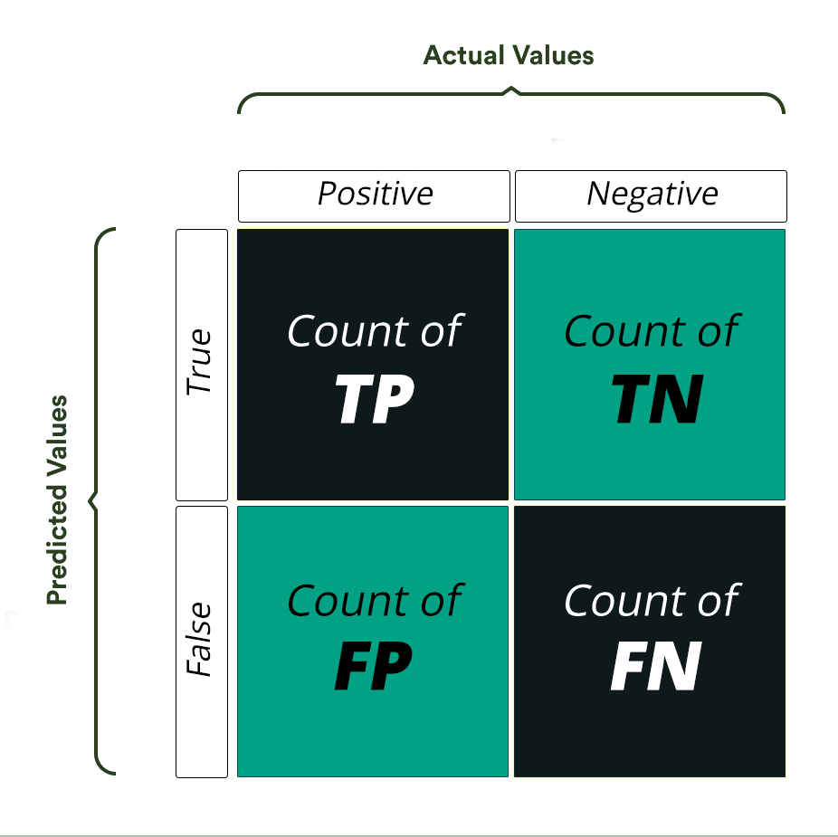

# Chapter 3: Classification

This chapter focuses on classification tasks, distinguishing them from regression and exploring various methods, performance evaluation metrics, and strategies in machine learning. The key aspects are summarized as follows:

### **Introduction to Classification**

- Classification involves predicting discrete labels (classes) instead of continuous values.
- The MNIST dataset, containing 70,000 images of handwritten digits, serves as the primary example for this chapter. Each image (28x28 pixels) is represented as a 784-dimensional feature vector.

### Training a Binary Classifier

- A binary classifier focuses on two classes (e.g., detecting digit "5").
- Using the `SGDClassifier` (Stochastic Gradient Descent), a binary model was trained to identify the digit "5" vs. non-5.
- The dataset is split into a training set (60,000 samples) and a test set (10,000 samples), with pre-shuffling for effective cross-validation.

### Performance Evaluation Metrics

- **Accuracy**: This is used to measure the performance of the model. It is the ratio of Total correct instances to the total instances.
    - Accuracy = $\frac{TP \space + \space TN}{TP\space + \space + \space TN \space + \space FP \space + \space FN}$
        
        <aside>
        ⚠️
        
        *Insufficient for skewed datasets (e.g., where one class dominates).*
        
        </aside>
        
- **Confusion Matrix**: This matrix provides counts for True Positives (*TP*), False Positives (*FP*), True Negatives (*TN*), and **F**alse **N**egatives (*FN*), enabling deeper insights.

- **True Positive (TP):** *The model correctly predicted a positive outcome (the actual outcome was positive).*
- **True Negative (TN):** *The model correctly predicted a negative outcome (the actual outcome was negative).*
- **False Positive (FP):** *The model incorrectly predicted a positive outcome (the actual outcome was negative). Also known as a Type I error.*
- **False Negative (FN):** *The model incorrectly predicted a negative outcome (the actual outcome was positive). Also known as a Type II error.*

- **Precision**: It is a measure of how accurate a model’s positive predictions are. It is defined as the ratio of true positive predictions to the total number of positive predictions made by the model.
    - *Precision* = $\frac{TP}{TP\space +\space FP}$
- **Recall**: It measures the effectiveness of a classification model in identifying all relevant instances from a dataset. It is the ratio of the number of true positive (TP) instances to the sum of true positive and false negative (FN) instances.
    - *Recall* = $\frac{TP}{TP \space+\space FN}$
- **F1 Score**: Harmonic mean of precision and recall, favoring balance over extreme values.
- **ROC Curve**: Plots True Positive Rate (TPR) vs. False Positive Rate (FPR), emphasizing the trade-off between sensitivity and specificity.
- **AUC (Area Under Curve)**: Higher values indicate better performance; AUC close to 1.0 is ideal.

### Multiclass Classification

- Extends binary classification to handle multiple classes (e.g., MNIST digits 0-9).
- Strategies:
    - **One-vs-Rest (OvR)**: Train a binary classifier for each class.
    - **One-vs-One (OvO)**: Train a binary classifier for every pair of classes.
- Scikit-Learn automatically chooses the strategy based on the classifier, or users can force specific strategies.

### Multilabel Classification

- Allows multiple labels per instance (e.g., a digit being odd and greater than 7).
- **K-Nearest Neighbors (KNN)** classifier is used for this example, supporting multi-output predictions.
- Evaluation involves computing metrics like F1 scores for each label.

### Multioutput Classification

- Generalization of multilabel classification where each label can have multiple values.
- Example: Removing noise from images by predicting clean pixel values.

### Techniques to Improve Classification

- **Data Augmentation**: Expanding the training set by generating shifted or rotated variants.
- **Error Analysis**:
    - Using confusion matrices to identify systematic misclassifications.
    - Investigating individual errors to uncover model weaknesses.
- **Feature Engineering**: Introducing domain-specific features (e.g., counting closed loops in digits).
- **Preprocessing**: Normalizing, scaling, or centering inputs to improve model robustness.

### Conclusion

This chapter equips readers with foundational concepts and tools for classification, preparing them to tackle diverse supervised learning challenges. It emphasizes the importance of rigorous evaluation, thoughtful model selection, and systematic error analysis to build robust classifiers.